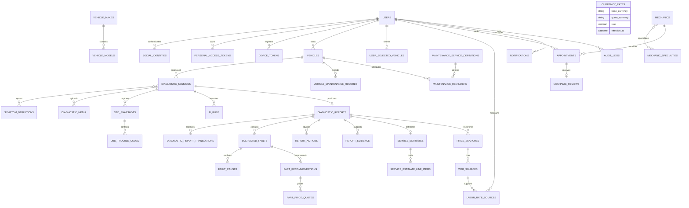
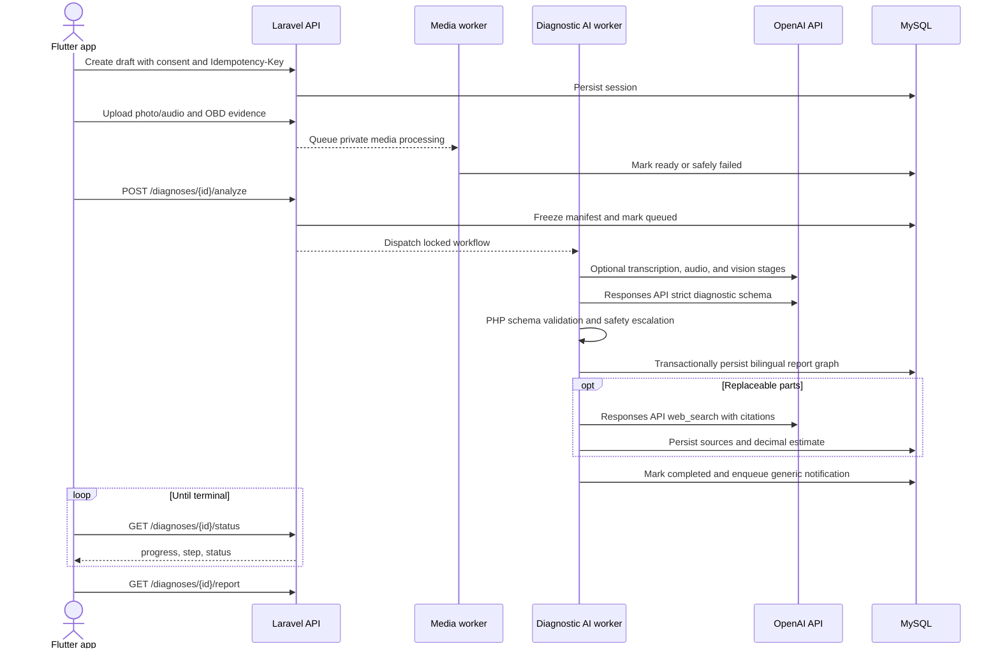

# Architecture

## Domain map

Framework cache, jobs, sessions, reset tokens, webhook receipts, media observations, translations, and idempotency fields support this graph without leaking provider payloads into mobile-facing models.

## Diagnostic sequence

Locks, idempotency keys, state-transition checks, and a final cancellation check prevent duplicate or stale completion. A failed price search leaves the validated diagnostic report readable with an unavailable/partial estimate. Source prices retain their original currency; normalization occurs only when an administrator has appended a provider-attributed currency rate. Labor is included only when current configured hours and hourly-rate ranges cover the job, otherwise the estimate remains partial and explicitly excludes it.
